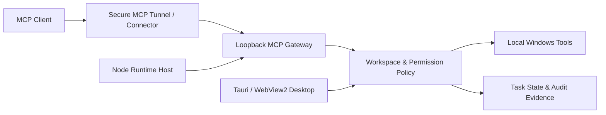

# Sovereign Code Runtime

[简体中文](README.zh-CN.md)

[](https://github.com/DZ20000/sovereign-code-runtime-public/actions/workflows/source-check.yml)
[](LICENSE)


> **Source preview.** This repository publishes source code, not an announced binary release or proof of an installed system. Read [Security](SECURITY.md), the [threat model](docs/threat-model.md), and [dependency security](docs/dependency-security.md) before using it with sensitive data.

Sovereign lets an **MCP client operate an authorized Windows workspace**. It supplies local tools, workspace permissions, task state, and audit evidence; it does not include a built-in model client.

ChatGPT Web is one supported connection path described below. **Sovereign Code Runtime is an independent open-source project and is not affiliated with, endorsed by, or sponsored by OpenAI.** OpenAI and ChatGPT are trademarks of their respective owner.

This is an independent open-source project, not an official OpenAI product.

## Highlights

- Loopback-only MCP Gateway with explicit Bearer authentication.
- Workspace-scoped file, terminal, Python, browser, desktop, workflow, and task tools.
- Four local permission profiles, native approval for consequential actions, and local audit receipts.
- Tauri/WebView2 desktop shell, Node Runtime Host, and an optional Android preview agent.
- Source and dependency checks designed for a clean Windows clone.

## Architecture



## Quick start

Requirements: Windows 10/11, Node.js 24+, pnpm 10+, WebView2, the Rust MSVC toolchain, and the .NET Framework C# compiler.

```powershell
pnpm install --frozen-lockfile
pnpm dev:desktop
```

To locate existing verified build outputs without installing or launching them:

```powershell
pnpm products
pnpm products:open
```

Windows users can also double-click `open-products.cmd`. Chinese console output is available through `pnpm products:zh` and `pnpm products:open:zh`. See the [build-output guide](releases/README.md).

## Connect ChatGPT

1. Start Sovereign and authorize the workspace folder.
2. Make the official Windows `tunnel-client` available on `PATH`, select it locally, or set `SCR_TUNNEL_CLIENT_PATH` before launch.
3. In **ChatGPT Connection**, enter the OpenAI tunnel ID and runtime key, choose a permission level, and start the connection.
4. Wait for **Ready**, configure the ChatGPT custom app with that tunnel ID, and verify a read-only call first.

```text
ChatGPT Web -> OpenAI Secure MCP Tunnel -> loopback Gateway
            -> permission and workspace policy -> local tools and audit
```

The Gateway binds to `127.0.0.1`. Connector credentials are passed through a child-process environment rather than command-line arguments. Persisted tunnel keys and proxy settings use Windows DPAPI. Optional control-plane proxies coordinate routes; they do not proxy local MCP traffic.

## Permissions and safety

| Profile | External tool behavior |
| --- | --- |
| L1 Observe | Read-only observation tools. |
| L2 Workspace | Contained workspace writes, local Git writes, fixed validation, and run cancellation. |
| L3 Consequential | L1/L2 directly; consequential calls require fresh native approval. |
| L4 Bypass | Declared tools without Sovereign approval prompts after explicit local confirmation. |

Remembered permissions are bound to the exact workspace. Workspace restore is a separate setting: **enabling or disabling it never changes the active L1-L4 permission**. L4 does not grant administrator elevation or disable containment, revision checks, schemas, or audit.

PowerShell, ConPTY, Python, browser evaluation, and desktop control execute with the Windows user's rights and are **not operating-system sandboxes**. Secure Desktop, credential entry, elevation, passkeys, OTPs, and CAPTCHA remain human handoffs.

Sovereign **has no notification milestones, content-hash deduplication, or per-domain/rolling notification buckets**. Notifications are semantic signals for meaningful work, completion, or operator attention; routine successful non-workflow runs do not require an automatic notification.

## Repository map

| Path | Purpose |
| --- | --- |
| `apps/desktop-tauri` | Primary Tauri/WebView2 shell, packaging, and Guardian. |
| `apps/desktop/src/renderer` | Shared workbench UI used by Tauri and the legacy Electron host. |
| `apps/runtime-host` | Node sidecar hosting the control plane and Gateway. |
| `apps/gateway` | MCP transport, live catalog, and optional headless entry point. |
| `packages/control-plane` | Settings, permissions, tasks, tunnel supervision, and lifecycle. |
| `packages/runtime-core` | Policy, schemas, stores, and audit primitives. |
| `packages/windows-adapter` | Contained Windows filesystem and process primitives. |
| `packages/toolkit` | Tool schemas and dispatch. |
| `apps/android-agent` | Independent Android preview. |

## Documentation

- [Documentation index](docs/README.md)
- [Architecture](docs/architecture.md)
- [Development and validation](docs/development.md)
- [Capability catalog](docs/capability-catalog.md)
- [Remote host and recovery](docs/remote-host.md)
- [Contributing](CONTRIBUTING.md)
- [Security policy](SECURITY.md)
- [Privacy and local data](PRIVACY.md)
- [Support](SUPPORT.md)

## Release boundaries

Build success, package integrity, installation, activation, and observed running behavior are separate results. A source CI pass does not certify native UI behavior, elevation, installation, or a signed binary. Release artifacts should be attached to GitHub Releases rather than committed to source history.

## License

Original source code and documentation are licensed under the [Apache License 2.0](LICENSE). Third-party components retain their own licenses; see [NOTICE](NOTICE) and [THIRD_PARTY_NOTICES.md](THIRD_PARTY_NOTICES.md).
