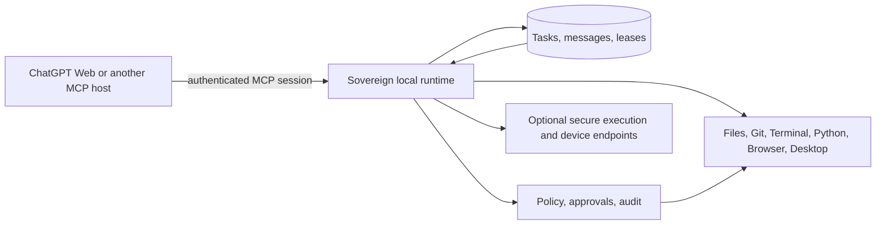

# Sovereign Code Runtime

**Durable local work for ephemeral AI agents.**

[](https://github.com/DZ20000/sovereign-code-runtime-public/actions/workflows/source-check.yml)
[](LICENSE)


AI conversations disconnect, expire, and get replaced. Your local work should not.

Sovereign keeps **Tasks, Agent ownership, permissions, messages, execution state, and evidence** on your Windows computer, so another authorized Agent session can safely continue. ChatGPT or another MCP host supplies reasoning; Sovereign supplies the durable local operating environment.

**[中文说明](README.zh-CN.md)** · **[Run the continuity demo](#run-the-continuity-demo)** · **[Architecture](docs/architecture.md)** · **[Security](SECURITY.md)** · **[Contributing](CONTRIBUTING.md)**

> **Source preview.** This repository publishes source code, not an announced binary release or proof of an installed system. Source CI does not certify native desktop behavior, and the full dependency-audit job may remain red for documented unresolved build dependencies. Read [Security](SECURITY.md), the [threat model](docs/threat-model.md), and [dependency security](docs/dependency-security.md), and see [release evidence](#release-evidence-and-boundaries) before treating a build as deployed.

ChatGPT Web is one supported connection path. **Sovereign Code Runtime is an independent open-source project and is not affiliated with, endorsed by, or sponsored by OpenAI.** OpenAI and ChatGPT are trademarks of their respective owners.

## The problem Sovereign addresses

A web conversation is a poor place to store the authoritative state of long-running local work. It can disappear while a command is running, after files have changed, or before another Agent learns what happened.

Sovereign makes the work itself a local object:

- a Task has a persistent identity, owner, status, current step, progress, and conversation;
- an Agent is online only while a valid session lease is live;
- ownership changes invalidate stale sessions instead of letting two sessions act as the same owner;
- local actions remain constrained by workspace, permission, observation revision, and approval state;
- runs and audit receipts describe what actually happened, including failures and unknown outcomes;
- Renderer and Runtime candidates must pass controlled activation or cutover rules before becoming authoritative.

The design goal is simple:

> Models and sessions may be replaced. Local work, authority, and evidence must not disappear with them.

## Run the continuity demo

The demo uses the real Task registry, SQLite persistence, and session-lease implementation in an isolated temporary directory. It does **not** contact ChatGPT, start the Tunnel, read your Sovereign data, or mutate a project.

Requirements: Windows, Node.js 24+, and pnpm 10+.

```powershell
pnpm install --frozen-lockfile
pnpm demo:continuity
```

Expected result:

```text
Sovereign continuity demo
[pass] Session A created a durable local Task and checkpoint.
[pass] The Task and messages survived a registry restart.
[pass] Closing Session A preserved workflow state but removed its live lease.
[pass] Session B resumed the same Task from local state.
[pass] Session A was rejected after closure (POLICY_DENIED).

Result: durable work survived; stale session authority did not.
```

Use `pnpm demo:continuity -- --json` for a machine-readable report, or read [the demo guide](docs/continuity-demo.md).

## What remains local

| Durable local fact | Why it matters |
| --- | --- |
| Task identity and project | Work is not reduced to one browser transcript. |
| Current Agent owner and principal | The system can reject the wrong or superseded actor. |
| Session leases and presence | “Online” is derived from live ownership, not a stale UI label. |
| Messages and acknowledgement cursors | A replacement session can retrieve unprocessed operator instructions. |
| Runs and execution evidence | Completion is backed by local outcomes rather than an Agent claim. |
| Permission and workspace binding | Remembered authority remains tied to the exact authorized workspace. |
| Coordination envelopes | Agent-to-Agent requests retain delivery, acknowledgement, reply, expiry, and recipient-change state. |
| Runtime and release provenance | A candidate cannot silently promote itself into the current authority. |

Sovereign does not copy a model's private reasoning or automatically reproduce an entire ChatGPT transcript. Continuity comes from durable work facts and explicit handoff context.

## How it fits


```mermaid
flowchart LR
    A[ChatGPT Web or another MCP host] -->|authenticated MCP session| B[Sovereign local runtime]
    B --> C[(Tasks, messages, leases)]
    B --> D[Policy, approvals, audit]
    B --> E[Files, Git, Terminal, Python, Browser, Desktop]
    B --> F[Optional secure execution and device endpoints]
    D --> E
    C --> B
```

The normal remote path is:

```text
ChatGPT Web → OpenAI Secure MCP Tunnel → loopback Gateway
            → session / Task / permission policy → local tools and audit
```

The Gateway stays on `127.0.0.1`, and Sovereign does not include a built-in model client.

## What Sovereign is — and is not

| Category | Primary responsibility |
| --- | --- |
| Ordinary MCP tool server | Expose callable tools. |
| Agent framework | Own the model loop, planning, prompts, or provider selection. |
| Desktop automation utility | Perform mouse, keyboard, window, browser, or shell actions. |
| **Sovereign** | Preserve durable work and enforce who may perform which local action, from which live session, against which observed state, with what evidence. |

Sovereign includes MCP tools and desktop automation, but those are execution surfaces. The differentiator is the persistent authority model around them.

## Desktop application

The Windows workbench provides Home, Tasks, ChatGPT Connection, Task History, Terminal, Python, Browser, Desktop Control, Workflows, Capabilities, Approvals, Audit, and Settings surfaces.

To run the full desktop application from source:

1. Install Windows 10/11, WebView2, Node.js 24+, pnpm 10+, the Rust MSVC toolchain, and the .NET Framework C# compiler.
2. Run `pnpm install --frozen-lockfile`.
3. Run `pnpm dev:desktop`.
4. Select the exact folder the Agent may use.
5. Configure the official Windows `tunnel-client`, Tunnel ID, and runtime key in **ChatGPT Connection**.
6. Wait for **Ready**, then verify a read-only call before authorizing consequential work.

To locate existing verified build outputs without installing or launching them:

```powershell
pnpm products
pnpm products:open
```

Windows users can also double-click `open-products.cmd`. Chinese console output is available through `pnpm products:zh` and `pnpm products:open:zh`.

For local build inventory and verification rules, see [releases/README.md](releases/README.md). A source checkout, packaged candidate, installed application, active Renderer, and active Runtime Host may all be different revisions.

## Authority model

| Profile | External tool behavior |
| --- | --- |
| L1 Observe | Read-only observation tools. |
| L2 Workspace | L1 plus contained workspace writes, local Git writes, fixed validation, and run cancellation. |
| L3 Consequential | L1/L2 directly; consequential calls require fresh native approval. |
| L4 Bypass | Declared tools without Sovereign approval prompts after explicit local confirmation. |

Remembered permissions are bound to the exact workspace. Workspace restore is a separate setting: **enabling or disabling it never changes the active L1-L4 permission**. L4 does not grant administrator elevation and does not remove schemas, containment, revision checks, identity checks, or audit.

Authority also has a freshness dimension:

- stale file hashes are rejected before guarded writes;
- stale browser and desktop observation revisions are rejected before actions;
- closed session leases cannot be reopened;
- an online Task owner cannot be replaced by another session;
- ownership changes fence the previous Agent identity;
- a candidate Runtime must drain accepted work, establish a checkpoint, acquire a fencing generation, and pass canary checks before durable promotion;
- unknown execution outcomes are not silently retried as success.

## Capabilities

The live manifest is authoritative. Discover it through MCP `tools/list`, the authenticated Gateway `/v1/manifest`, or:

```text
capabilities.search
capabilities.describe
capabilities.execute
capabilities.snapshot
client.catalog_status
```

Current capability families include workspace and Git operations, managed Terminal and Python runs, browser automation, revision-bound Windows desktop control, workflows, Tasks, Agent coordination, context retrieval, optional semantic-code tools, and optional secure execution.

Read [capability discovery](docs/capability-catalog.md), [tool packs](docs/tool-packs.md), [Task and Agent Hub](docs/task-agent-hub.md), and [Agent coordination](docs/task-coordination.md) for the exact contracts.

## Notifications

Sovereign **has no notification milestones, content-hash deduplication, or per-domain/rolling notification buckets**. Notifications are semantic signals for meaningful work, completion, or operator attention; routine successful non-workflow runs do not require an automatic notification.

## Security boundaries

PowerShell, ConPTY, Python (including `-I`), browser evaluation, and normal desktop control run with the current Windows user's rights; they are **not OS sandboxes**. Only execution explicitly routed through the optional [secure-execution pack](docs/secure-execution.md) uses its reviewed Docker boundary.

Secure Desktop, credentials, passkeys, OTPs, CAPTCHAs, and elevation consent remain human handoffs. Persisted Tunnel keys and proxy settings use Windows DPAPI-protected ciphertext, while plaintext remains in trusted-process memory. Review the [threat model](docs/threat-model.md) before enabling consequential authority.

## Current maturity

Implemented source paths include the Tauri/WebView2 shell, Node Runtime Host, MCP Gateway, workspace-bound L1-L4 policy, native approvals, audit, persistent Tasks and messages, session leases, Agent coordination, Tunnel supervision, Host Guardian recovery, capability discovery, Renderer update management, and Runtime candidate cutover machinery.

Important boundaries remain:

- this repository is still presented as a source preview rather than an announced public binary release;
- full application restart does not yet provide general interrupted-task replay;
- there is no offline remote task queue or pre-login Windows service;
- ordinary Terminal and Python execution are not OS-isolated;
- public production trust material and Authenticode signing are not implied by the update mechanisms;
- Android and session-local computer endpoints require their own real-device and environment acceptance.

The documentation deliberately distinguishes design, test success, packaged candidate, installation, activation, and observed running behavior.

## Develop

```powershell
pnpm install --frozen-lockfile
pnpm typecheck
pnpm test:demo-continuity
pnpm dev:desktop
```

Useful locations:

| Location | Responsibility |
| --- | --- |
| `apps/desktop-tauri` | Tauri/WebView2 shell, Rust authority boundary, packaging, and Guardian. |
| `apps/desktop/src/renderer` | Shared workbench UI used by the Tauri and legacy Electron shells. |
| `apps/runtime-host` | Node sidecar hosting the control plane and Gateway. |
| `apps/gateway` | MCP transport, live catalog, and optional headless entry point. |
| `packages/control-plane` | Settings, permissions, Tasks, leases, coordination, Tunnel, and runtime lifecycle. |
| `packages/runtime-core` | Policy, audit, run, and workflow primitives. |
| `packages/windows-adapter` | Windows execution and automation primitives. |
| `packages/toolkit` | Tool definitions and dispatch. |
| `packages/update-core` | Layered update and recovery transactions. |
| `apps/android-agent` | Independent Android developer preview. |

Read the [development guide](docs/development.md) and [repository layout](docs/repository-layout.md) before changing, packaging, or altering installed state.

## Contribute

Contributions are most useful when they strengthen a documented invariant, improve the first-run path, add deterministic compatibility evidence, or make authority state easier to understand.

Start with [CONTRIBUTING.md](CONTRIBUTING.md). Bug and feature templates ask explicitly whether a change affects workspace containment, Task ownership, session leases, approvals, unknown outcomes, or Runtime authority. Security reports belong in the private channel described by [SECURITY.md](SECURITY.md), not in a public Issue.

## Release evidence and boundaries

Build success, package verification, installation, activation, and observed running behavior are separate facts. A dry run, Renderer smoke test, portable smoke test, or valid manifest does not prove that an NSIS installation succeeded or that a candidate is currently active.

Renderer updates, Runtime Host updates, and full-application restarts have different coordination rules. Use the applicable [Renderer](docs/renderer-hot-updates.md), [Runtime Host](docs/runtime-candidate-updates.md), or [application restart](docs/application-restart-updates.md) guide before changing running state. Release artifacts should be attached to GitHub Releases rather than committed to source history.

## License

Sovereign's original source code and documentation are licensed under the [Apache License, Version 2.0](LICENSE). Third-party components retain their own licenses; see [NOTICE](NOTICE) and [THIRD_PARTY_NOTICES.md](THIRD_PARTY_NOTICES.md).
