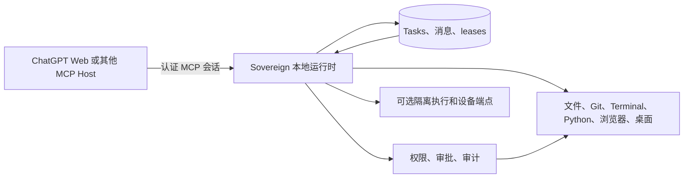

# Sovereign Code Runtime

**为短暂的 AI 会话保存可持续的本地工作。**

[](https://github.com/DZ20000/sovereign-code-runtime-public/actions/workflows/source-check.yml)
[](LICENSE)


AI 对话会断开、过期或被替换，但本地工作不应随之消失。

Sovereign 把 **Task、Agent 所有权、权限、消息、执行状态和证据** 保存在 Windows 本机，使另一个经过授权的 Agent 会话能够安全接续。ChatGPT 或其他 MCP Host 负责推理，Sovereign 负责长期存在的本地工作环境。

**[English](README.md)** · **[运行连续性 Demo](#运行连续性-demo)** · **[架构](docs/architecture.md)** · **[安全说明](SECURITY.md)** · **[参与贡献](CONTRIBUTING.md)**

> **源码预览。** 本仓库发布的是源码，不是已宣布的二进制发行版，也不是安装态验收证明。源码 CI 不等于原生桌面验收；完整依赖审计也可能因已记录的构建依赖问题保持失败。在敏感环境中使用前，请阅读[安全政策](SECURITY.md)、[威胁模型](docs/threat-model.md)、[依赖安全说明](docs/dependency-security.md)和[发布证据与边界](#发布证据与边界)。

ChatGPT Web 是一种受支持的连接方式。**Sovereign Code Runtime 是独立开源项目，与 OpenAI 不存在隶属、背书或赞助关系。** OpenAI 与 ChatGPT 是其各自权利人的商标。

## SO 解决什么问题

网页对话并不适合作为长期本地工作的权威存储。会话可能在命令运行中、文件已经修改后，或者交接完成前消失。

Sovereign 把“工作本身”变成本地持久对象：

- Task 有稳定身份、项目、所有者、状态、当前步骤、进度和对话；
- 只有持有有效 session lease 的 Agent 才被视为在线；
- 所有权变化会使旧会话失效，避免两个会话同时冒充当前负责人；
- 本地动作仍受工作区、权限、观察 revision 和审批状态约束；
- Runs 与审计回执记录真实结果，包括失败和未知结果；
- Renderer 与 Runtime 候选必须通过受控激活或切换规则后才能取得权威。

核心目标是：

> 模型和会话可以更换，但本地工作的状态、权威和证据不能随之消失。

## 运行连续性 Demo

这个 Demo 使用真实的 Task Registry、SQLite 持久化和 session lease 实现，但只在临时目录中运行。它**不会**连接 ChatGPT、启动 Tunnel、读取你的 SO 任务库或修改项目。

要求：Windows、Node.js 24+、pnpm 10+。

```powershell
pnpm install --frozen-lockfile
pnpm demo:continuity
```

预期输出：

```text
Sovereign continuity demo
[pass] Session A created a durable local Task and checkpoint.
[pass] The Task and messages survived a registry restart.
[pass] Closing Session A preserved workflow state but removed its live lease.
[pass] Session B resumed the same Task from local state.
[pass] Session A was rejected after closure (POLICY_DENIED).

Result: durable work survived; stale session authority did not.
```

使用 `pnpm demo:continuity -- --json` 可获得机器可读报告。详细说明见 [连续性 Demo 指南](docs/continuity-demo.md)。

## SO 在本地保存什么

| 本地持久事实 | 作用 |
| --- | --- |
| Task 身份和所属项目 | 工作不依赖某一个浏览器 transcript。 |
| 当前 Agent owner 和 principal | 系统能拒绝错误或已被替换的执行者。 |
| Session lease 与 presence | “在线”来自真实租约，而不是过时的 UI 标签。 |
| 消息与确认游标 | 新会话可以读取尚未处理的用户指令。 |
| Runs 与执行证据 | 完成状态由本地结果支持，而不是只听 Agent 声称。 |
| 权限和工作区绑定 | 记忆权限仍绑定精确授权目录。 |
| Coordination envelope | Agent 间请求保留送达、读取、确认、回复、过期和接收者变化状态。 |
| Runtime 与发布来源 | 候选版本不能自行宣布成为当前权威。 |

Sovereign 不复制模型的私有推理，也不会自动搬运完整 ChatGPT 对话。连续性来自持久工作事实和明确交接上下文。

## 所处位置



常规远程连接路径：

```text
ChatGPT Web → OpenAI Secure MCP Tunnel → 本机 loopback Gateway
            → session / Task / permission policy → 本地工具与审计
```

Gateway 仅监听 `127.0.0.1`，SO 也不内置模型客户端。

## SO 不只是 Windows MCP

| 类型 | 主要职责 |
| --- | --- |
| 普通 MCP Tool Server | 暴露可调用工具。 |
| Agent Framework | 管理模型循环、提示词、规划或 Provider。 |
| 桌面自动化工具 | 执行鼠标、键盘、窗口、浏览器或 Shell 动作。 |
| **Sovereign** | 保存长期工作，并判断哪个 live session 能在什么工作区、基于什么观察状态、以什么权限执行哪项本地动作，以及留下什么证据。 |

SO 也提供 MCP 工具和桌面自动化，但这些是执行表面；其差异化在于围绕执行建立的持久权威模型。

## Windows 桌面应用

Workbench 包含 Home、Tasks、ChatGPT Connection、Task History、Terminal、Python、Browser、Desktop Control、Workflows、Capabilities、Approvals、Audit 和 Settings。

从源码启动完整桌面应用：

1. 准备 Windows 10/11、WebView2、Node.js 24+、pnpm 10+、Rust MSVC 工具链和 .NET Framework C# 编译器。
2. 运行 `pnpm install --frozen-lockfile`。
3. 运行 `pnpm dev:desktop`。
4. 选择 Agent 可以使用的精确目录。
5. 在 **ChatGPT Connection / ChatGPT 连接** 中配置官方 Windows `tunnel-client`、Tunnel ID 和 runtime key。
6. 等待 **Ready**，先验证只读调用，再授权有后果的工作。

只定位已有且可核验的构建产物，不安装、不启动：

```powershell
pnpm products:zh
pnpm products:open:zh
```

也可以双击英文文件名 `open-products.cmd`（默认英文输出）。

本机构建产物清单与验证规则见 [releases/README.zh-CN.md](releases/README.zh-CN.md)。源码、打包候选、已安装应用、当前 Renderer 和当前 Runtime Host 可能来自不同 revision。

## 权限与权威模型

| 等级 | 外部工具行为 |
| --- | --- |
| L1 Observe | 只读观察工具。 |
| L2 Workspace | L1 加工作区内写入、本地 Git 写入、固定验证和取消 Run。 |
| L3 Consequential | L1/L2 直接执行；有后果的调用需要新的原生审批。 |
| L4 Bypass | 经本地明确确认后，声明的工具不再弹出 SO 审批窗口。 |

记忆权限绑定工作区。L4 不授予管理员权限，也不会移除 schema、containment、revision、身份检查或审计。

权威还具有“新鲜度”：

- 文件 hash 过期时拒绝 guarded write；
- 浏览器或桌面 observation revision 过期时拒绝动作；
- 已关闭的 session lease 不能重新打开；
- 在线 Task owner 不能被另一个 Agent 会话替换；
- 所有权变化会 fence 旧 Agent；
- Runtime 候选必须排空已接收工作、建立 checkpoint、取得 fencing generation 并通过 canary 才能提交；
- 未知执行结果不会被静默重试成成功。

## 能力范围

当前 live manifest 才是权威来源。可通过 MCP `tools/list`、认证 Gateway `/v1/manifest`，或以下能力目录查询：

```text
capabilities.search
capabilities.describe
capabilities.execute
capabilities.snapshot
client.catalog_status
```

当前能力族包括工作区与 Git、受管 Terminal/Python Runs、浏览器、revision-bound Windows 桌面控制、Workflows、Tasks、Agent coordination、增量上下文、可选 semantic-code 和可选 secure execution。

详见 [能力目录](docs/capability-catalog.md)、[Tool Packs](docs/tool-packs.md)、[Task and Agent Hub](docs/task-agent-hub.md) 和 [Agent 协调](docs/task-coordination.md)。

## 安全边界

PowerShell、ConPTY、Python（包括 `-I`）、浏览器 evaluation 和普通桌面控制使用当前 Windows 用户权限运行，**不是 OS sandbox**。只有明确路由到可选 [secure-execution pack](docs/secure-execution.md) 的任务才使用其已审阅 Docker 边界。

Secure Desktop、凭据、passkey、OTP、CAPTCHA 和 UAC 同意仍由人类处理。持久化 Tunnel key 与代理设置使用 Windows DPAPI 密文；明文只存在于可信进程内存。启用 consequential authority 前请阅读[威胁模型](docs/threat-model.md)。

## 当前成熟度

当前源码路径已经包含 Tauri/WebView2 Shell、Node Runtime Host、MCP Gateway、工作区绑定的 L1-L4、原生审批、审计、持久 Tasks 与消息、session lease、Agent coordination、Tunnel supervision、Host Guardian、能力目录、Renderer 更新管理和 Runtime candidate cutover。

仍需明确的边界：

- 当前仓库仍以 source preview 呈现，而非已宣布的公共二进制发行；
- 完整应用重启尚不提供通用中断任务重放；
- 尚无离线远程任务队列和 pre-login Windows Service；
- 普通 Terminal 与 Python 不是 OS 隔离执行；
- 更新机制的存在不代表已配置公共生产信任材料或 Authenticode；
- Android 与 session-local computer endpoint 仍需要各自的真机和环境验收。

文档会严格区分：设计存在、测试通过、候选已打包、安装成功、已激活和真实运行行为已观察。

## 开发

```powershell
pnpm install --frozen-lockfile
pnpm typecheck
pnpm test:demo-continuity
pnpm dev:desktop
```

开始修改、打包、安装或改变运行状态前，请阅读[开发指南](docs/development.md)和[仓库结构](docs/repository-layout.md)。

## 参与贡献

最有价值的贡献通常是：强化已记录的不变量、改善首次运行、增加确定性兼容证据，或让权威状态更容易理解。

从 [CONTRIBUTING.md](CONTRIBUTING.md) 开始。Issue 和 PR 模板会要求说明改动是否影响工作区 containment、Task ownership、session lease、审批、unknown outcome 或 Runtime authority。安全问题应使用 [SECURITY.md](SECURITY.md) 中的私有渠道，不要提交公开 Issue。

## 发布证据与边界

构建成功、包验证通过、安装成功、激活成功和真实运行行为是不同事实。Dry run、Renderer smoke、portable smoke 或合法 manifest 都不能证明 NSIS 已安装成功，也不能证明某个候选当前正在运行。

Renderer 更新、Runtime Host 更新和完整应用重启使用不同协调规则。改变运行状态前阅读对应的 [Renderer](docs/renderer-hot-updates.md)、[Runtime Host](docs/runtime-candidate-updates.md) 或[完整应用重启](docs/application-restart-updates.md)指南。发行产物应附加到 GitHub Releases，不应提交进源码历史。

## 许可证

Sovereign 原创源码和文档采用 [Apache License 2.0](LICENSE)。第三方组件保留各自许可证，详见 [NOTICE](NOTICE) 与 [THIRD_PARTY_NOTICES.md](THIRD_PARTY_NOTICES.md)。
